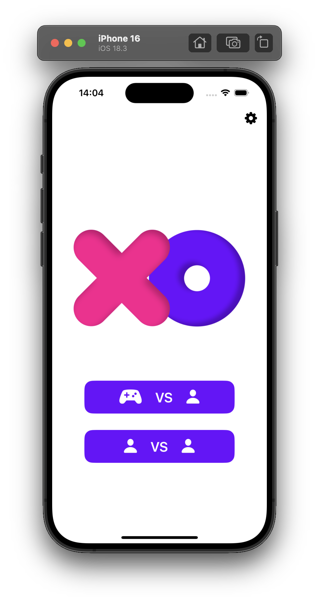
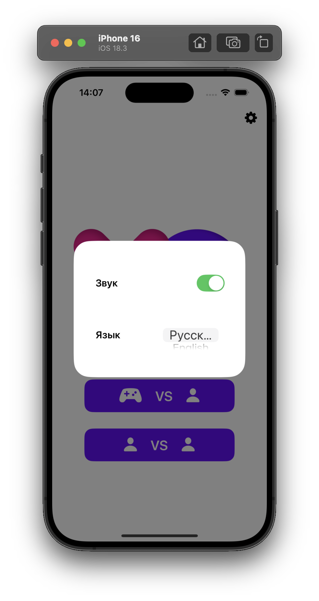
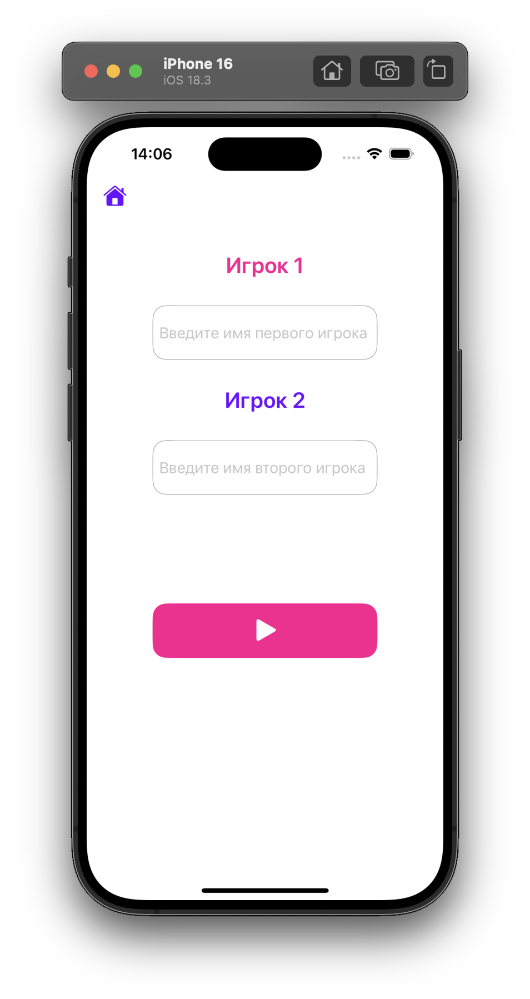
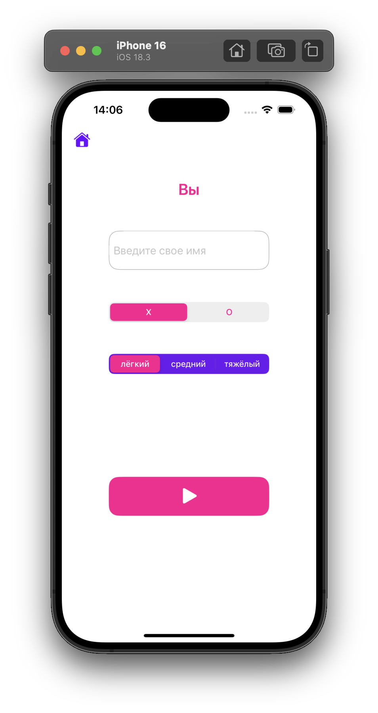
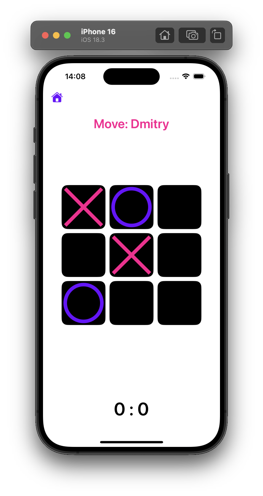
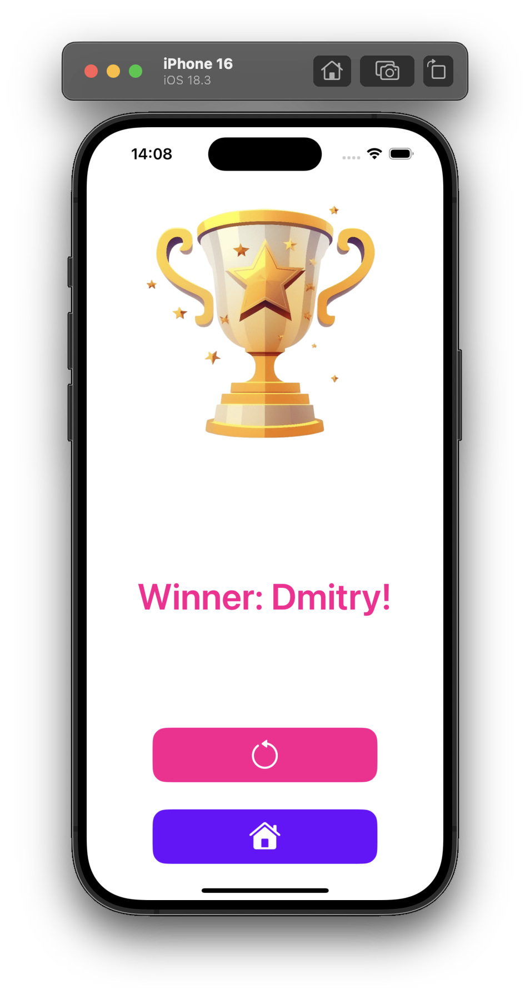

# Infinity XO

A unique take on classic tic-tac-toe with endless gameplay.
Old moves are automatically cleared, making a draw impossible.

---

## Idea

In the classic game, the board quickly fills up and the game ends in a draw.

This implementation uses a **clearing old squares** mechanism:

- when the board reaches a certain level of fullness, the earliest moves are automatically deleted
- the board is freed for new moves
- the game continues indefinitely

This makes the gameplay dynamic and changes the game strategy.

---

## Game modes

- 👥 Player vs. Player (single-screen)
- 🤖 Player vs. Bot

---

## Screenshots

   
  

