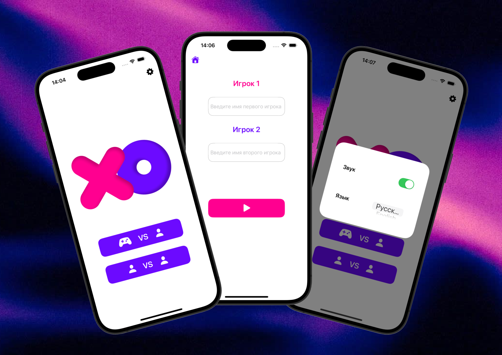
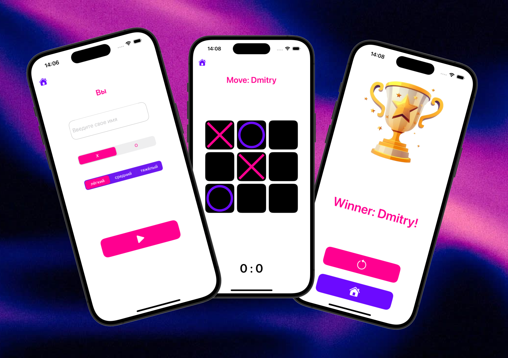

# Infinity XO (Rus)

>Уникальная версия классических крестиков-ноликов с бесконечным игровым процессом.  
Старые ходы автоматически удаляются, поэтому ничья невозможна.

---

## Идея

В классических крестиках-ноликах поле быстро заполняется и игра заканчивается ничьей.

В этой реализации добавлен механизм **удаления старых ходов**:

- когда поле достигает определённого уровня заполнения, самые ранние ходы автоматически удаляются  
- поле освобождается для новых ходов  
- игра продолжается бесконечно  

Это делает геймплей более динамичным и полностью меняет стратегию игры.

---

## Режимы игры

- 👥 Игрок против игрока (на одном устройстве)
- 🤖 Игрок против бота

---

# Infinity XO (En)

>A unique take on classic tic-tac-toe with endless gameplay.
Old moves are automatically cleared, making a draw impossible.

---

## Idea

In the classic game, the board quickly fills up and the game ends in a draw.

This implementation uses a **clearing old squares** mechanism:

- when the board reaches a certain level of fullness, the earliest moves are automatically deleted
- the board is freed for new moves
- the game continues indefinitely

This makes the gameplay dynamic and changes the game strategy.

---

## Game modes

- 👥 Player vs. Player (single-screen)
- 🤖 Player vs. Bot

---

## Скриншоты / Screenshots

  
   

